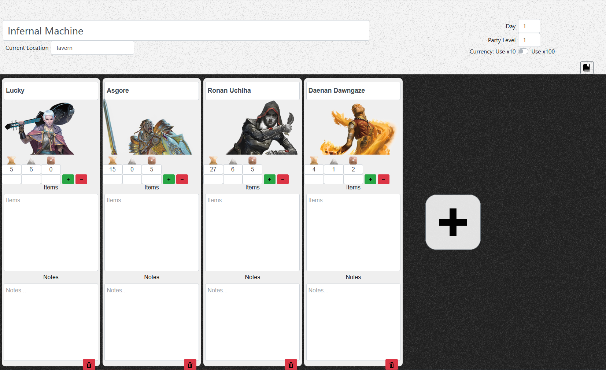

# RPG Manager

A party management tool for any Dungeon Master running a DnD Campaign. Allows up to 6 player characters and tracks name, class, money, items, and notes for each.

Stack:
Flask Web App, with React, Postgres, and uWSGI.

Try it out at: [https://alecj-phnx.herokuapp.com/rpgmanager](https://alecj-phnx.herokuapp.com/rpgmanager)

## Quick Start

Bring up the app:

`docker-compose up`

Get the docker container ID for SVC:

`docker ps`

Initialize the Database:

`docker exec -it <psqlContainerID> psql -U postgres`

`create database <database_name>`

Copy and rename config.ini.SAMPLE to config.ini

Update `db_dev_url` value with your database name

`docker exec <flaskContainerID> python src/manage.py db upgrade`

### Create a DB Migration

First make some change to the db. Then run:

`manage.py db migrate -m 'Some message'`

`manage.py db upgrade`

Make sure the new migration version file is checked in.

### Troubleshooting

If there is an issue creating a migration, check to see if the alembic_version in the db is correct and that all necessary migrations exist in ./migrations/versions

### Other Commands

Saving these just for reference.

Create a migrations directory.
`docker exec <flaskContainerID> python src/manage.py db init`

Run unit tests
`docker exec <flaskContainerID> pynt test`

Run unit tests with coverage report
`docker exec <flaskContainerID> pynt coverage`